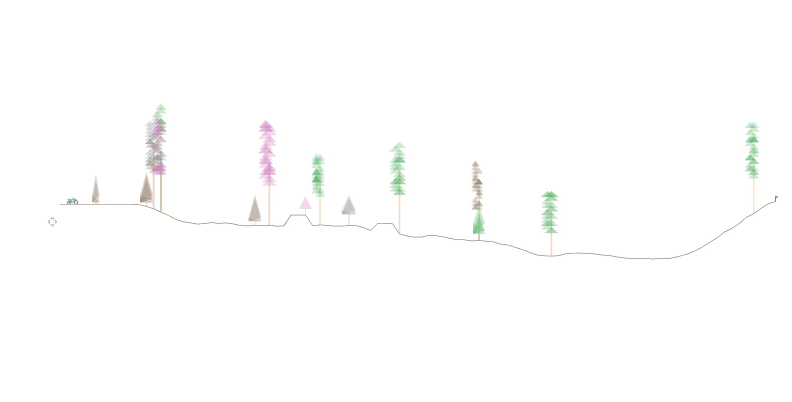

# Trials
 A 2D Bike OpenAI Gym compatible environment for deep reinforcement learning, inspired by the RedLynx title: [Trials](https://www.ubisoft.com/en-us/game/trials-rising/).



## Installation

1. Install all dependencies

```
pip3 install -r requirements.txt
```

2. [optional] Install RL baselines ([stable baselines](https://github.com/hill-a/stable-baselines))

```
sudo apt-get update && sudo apt-get install cmake libopenmpi-dev python3-dev zlib1g-dev
pip3 install stable-baselines
```

## Using the standalone environment

```
python3 trials/envs/trials.py
```


## Using as gym environment

### Register the trials collection of environments for use

``` 
pip3 install -e trials
```

### Training example

```python
# Environments
import gym
import trials

# Baselines
from stable_baselines import PPO2
from stable_baselines.common.policies import MlpPolicy
from stable_baselines.common.vec_env import DummyVecEnv


if __name__ == "__main__":

    env = gym.make("trials-v0")

    # Requires a vectorized environment
    env = DummyVecEnv([lambda: env])

    model = PPO2(MlpPolicy, env, verbose=1)
    model.learn(total_timesteps=20000)

    obs = env.reset()
    while True:
        action, _states = model.predict(obs)
        obs, reward, done, info = env.step(action)
        env.render()
        if done:
            obs = env.reset()

    env.close() # You don't really get here.